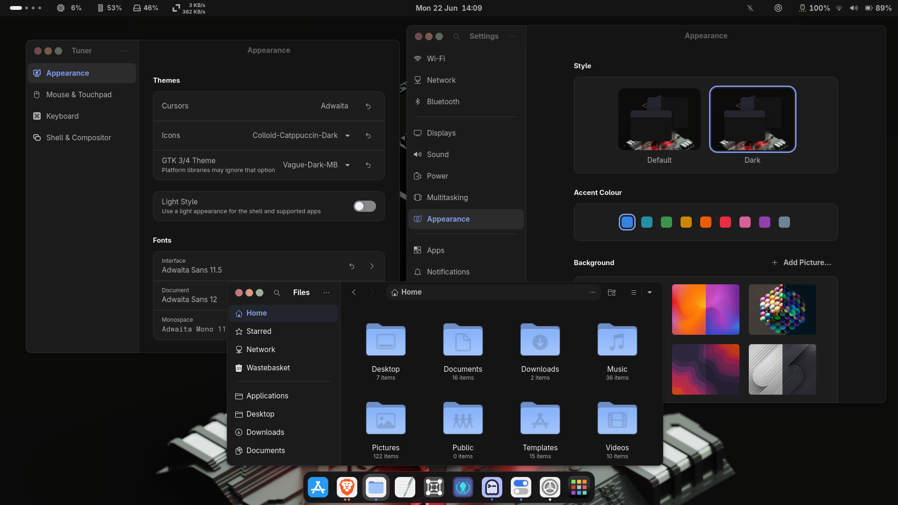

<h1 align="center">V A G U E &nbsp; G T K &nbsp; T H E M E</h1>

<p align="center">
  A modern, clean and soothing GTK theme based on Vague’s brilliant colour
  palette, designed to transform your Linux desktop into a sophisticated
  and stylish space where you can maximize your productivity.
</p>

> [!INFO]
> The inspiration for this theme came from my desire to have my favourite Neovim colour palettes integrated throughout my GNOME desktop.<br>
> To achieve this, I drew inspiration from [Vague for Neovim](https://github.com/vague-theme/vague.nvim) and the stunning GTK theme designs
> by [VinceLiuice](https://github.com/vinceliuice),
> and, of course, from the amazing colour palettes created by each designer and community.

<p align="center">
  
  
  
  
  
</p>

<p align="center">
  
</p>

## Variants

#### All Vague + Black backgrounds

| Variant | HEX Color |
| ------- | --------- |
| Dark |  |
| Medium |  |
| Soft |  |
| Light |  |
| Black |  |

#### All Vague accent colors

| Name | HEX (light) | HEX (dark) |
| ---- | ----------- | ---------- |
| Blue |  |  |
| Green |  |  |
| Orange |  |  |
| Pink |  |  |
| Purple |  |  |
| Red |  |  |
| Teal |  |  |
| Yellow |  |  |

## Quick Install

```bash
git clone https://github.com/Fausto-Korpsvart/Vague-GTK-Theme.git

cd Vague-GTK-Theme
```

- Support for GTK2/3 and generic themes for some DE.

```bash
./install.sh
```

- Support for GTK4/Libadwaita with symbolic links

```bash
./install.sh --libadwaita
```

- This only simulates the installation process. (It does not generate or install the theme)

```bash
./install.sh --dry-run
```

## Advanced customisation

- Support for GTK4
- Legacy Nautilus design
- macOS window buttons

```bash
./install.sh --libadwaita --tweaks files-legacy macos
```

- 14px rounded corners for windows & Gnome Shell
- 75% transparency for Gnome Shell

```bash
./install.sh --tweaks radius 14 --shell opacity 0.75 radius 14
```

## Flatpak

- This command uses the styles from the GTK3 themes in ‘~/.themes’

```bash
sudo flatpak override --filesystem=$HOME/.themes
```

- This command uses the icon themes in ~/.icons

```bash
sudo flatpak override --filesystem=$HOME/.icons
```

- This command uses the styles from the GTK4 themes in ‘~/.config/gtk-4.0’

```bash
flatpak override --user --filesystem=xdg-config/gtk-4.0
```

## Supported Distros

- [x] Fedora Family
- [x] Debian Family
- [x] Arch Family

> [!IMPORTANT]
> Tested on the latest versions of each major distribution and their main derivatives.<br>
> It should work on other derivatives, but no official tests have been carried out.

## Documentation

A detailed guide to a deeper understanding of how it works.

- [Vague Gallery](docs/GALLERY.md) — A gallery showing how the theme looks on different DE
- [Advanced Installation](docs/INSTALLATION.md) — General installation, Libadwaita, Flatpak & manual installation
- [CLI References](docs/TWEAKS.md) — Examples of how to use the CLI.

## TODO

- [ ] Add screenshots for more Desktops
- [ ] Add a few more icon packs
- [ ] Add extra configs for docks, etc...

## Related Themes

| Themes Projects | GitHub Repo | Gnome Look |
| --------------- | :---------: | :--------: |
| Catppuccin GTK | [Source](https://github.com/Fausto-Korpsvart/Catppuccin-GTK-Theme) | [Package](https://www.pling.com/p/1715554/) |
| Everforest GTK | [Source](https://github.com/Fausto-Korpsvart/Everforest-GTK-Theme) | [Package](https://www.pling.com/p/1695467/) |
| Gruvbox GTK | [Source](https://github.com/Fausto-Korpsvart/Gruvbox-GTK-Theme) | [Package](https://www.pling.com/p/1681313/) |
| Kanagawa GTK | [Source](https://github.com/Fausto-Korpsvart/Kanagawa-GKT-Theme) | [Package](https://www.pling.com/p/1810560/) |
| Material GTK | [Source](https://github.com/Fausto-Korpsvart/Material-GTK-Themes) | [Package](https://www.pling.com/p/1706139/) |
| Nightfox GTK | [Source](https://github.com/Fausto-Korpsvart/Nightfox-GTK-Theme) | [Package](https://www.pling.com/p/1929101/) |
| Osaka GTK | [Source](https://github.com/Fausto-Korpsvart/Osaka-GTK-Theme) | [Package](https://www.pling.com/p/2284009/) |
| Rose Pine GTK | [Source](https://github.com/Fausto-Korpsvart/Rose-Pine-GTK-Theme) | [Package](https://www.pling.com/p/1810530/) |
| Tokyonight GTK | [Source](https://github.com/Fausto-Korpsvart/Tokyonight-GTK-Theme) | [Package](https://www.pling.com/p/1681315/) |
| Vague GTK | [Source](https://github.com/Fausto-Korpsvart/Vague-GTK-Theme) | [Soon](https://www.pling.com/p/) |

## Support the Project

If you enjoy the project and would like to support future development:

[](https://www.paypal.com/donate/?hosted_button_id=LKVTXNA36FTV4)
